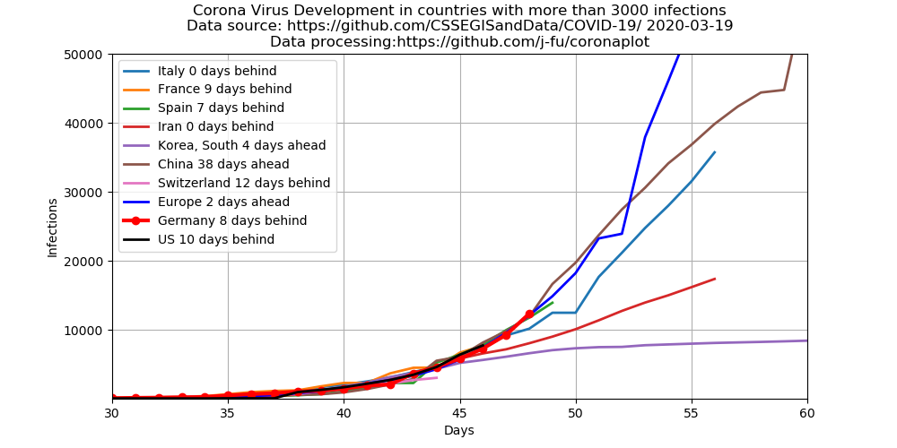
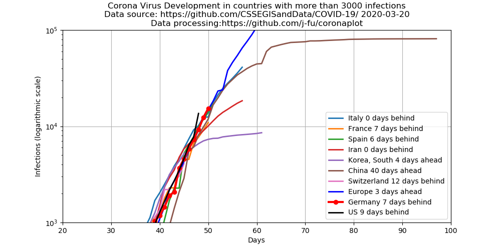

# Plot of corona virus development

The Center for Systems Science and Engineering (CSSE)  of Johns Hopkins University
collects and publishes the data of the diesease development.

After an idea of [Mark Handley](https://twitter.com/MarkJHandley/status/1237119688578138112?s=20) we take the same
data source and plot the data in a different way for those countries which have more than 3000 cases.

- [Blog post describing the project at CSSE](https://systems.jhu.edu/research/public-health/ncov/).
- [The](https://gisanddata.maps.arcgis.com/apps/opsdashboard/index.html#/bda7594740fd40299423467b48e9ecf6) corona virus map.
- Data for the plots come from the [github repository containing the current data](https://github.com/CSSEGISandData/COVID-19)
  which are [updated once per day around 23:59 (UTC)](https://github.com/CSSEGISandData/COVID-19/tree/master/csse_covid_19_data#update-frequency)
  and may lag behind the data in the map.    
  Data  for the  US are  based on  the state  data, county  data are
  ignored.  Data  for  Europe  currently  include   the  EU,
  Switzerland, Norway, UK only. All other European countries have
  (as of March 17) less than 100 infections each.

## Absolute numbers
 

Development of confirmed  adjusted cases since Jan  22, 2020.  Plotted with time shifts in order to compare initial exponential phases.

The data for Italy are plotted without time shift. E.g. the data for Germany are shifted 8 days backward in time. 
They show that as of March 16, Germany (my country...) is very much on the same track as Italy,
just eight days behind. 

## Logarithmic scale
 

This is the same plot, just with a logarithmic scale of the y-axis.

