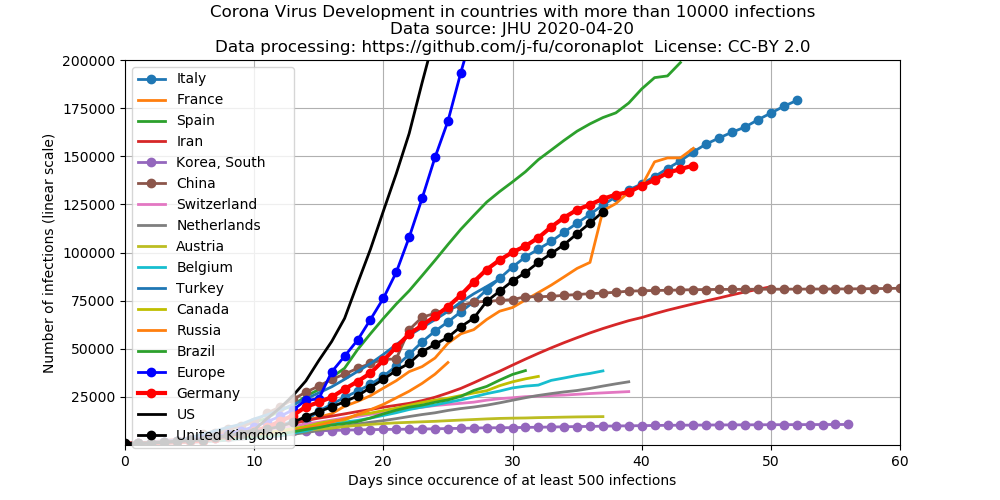
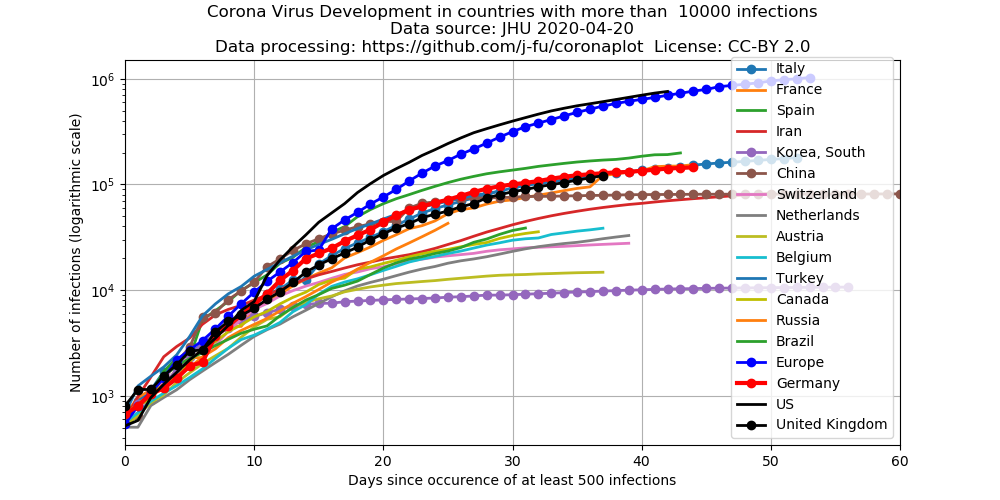

# Plot of corona virus development

The Center for Systems Science and Engineering (CSSE)  of Johns Hopkins University
collects and publishes the data of the diesease development.

- [Blog post describing the project](https://systems.jhu.edu/research/public-health/ncov/)
- [Github repo containing the current data](https://github.com/CSSEGISandData/COVID-19)
- [The](https://gisanddata.maps.arcgis.com/apps/opsdashboard/index.html#/bda7594740fd40299423467b48e9ecf6) corona virus map

After an idea of [Mark Handley](https://twitter.com/MarkJHandley/status/1237119688578138112?s=20) we take the same
data source and plot the data in a different way for those countries which have more than 1000 cases.

## Absolute numbers
 

Development of confirmed  adjusted cases since Jan  22, 2020.  Plotted with time shifts in order to compare initial exponential phases.

The data for Italy are plotted without time shift. E.g. the data for Germany are shifted 9 days backward in time. They show that as of March 12, Germany (my country...) is very much on the same track as Italy,
just nine days behind. 

## Logarithmic scale
 

This is the same plot, just with an logarithmic scale of the y-axis.

