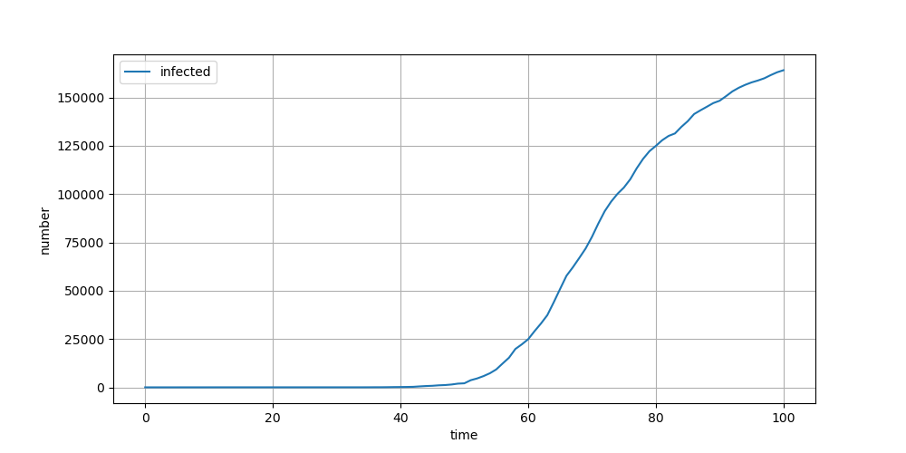
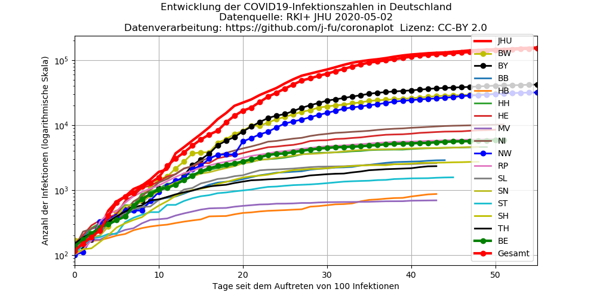
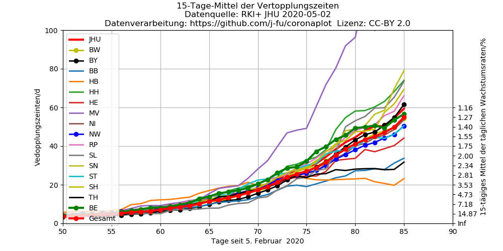

Hier findet sich dieselbe Darstellung für Deutschland auf der Basis der Daten des RKI,
wie sie auf [Wikipedia](https://de.wikipedia.org/wiki/COVID-19-Pandemie_in_Deutschland#Infektionsfälle)
zu finden sind. Siehe dort auch für die Erklärung der Kürzel für die einzelnen Bundesländer.

## Darstellung in absoluten Zahlen
 
Entwicklung der bestätigten Fälle seit dem ersten Tag mit mehr als 100 Infektionen. 

## Logarithmische Skala
 

Die gleiche Darstellung wie oben, nur mit einer logarithmischen Skala der y-Achse. In diesem Fall entspricht das exponentielle Wachstum einer geraden Linie.

## Entwicklung der täglichen Wachstumsratentu
 

 

Diese Darstellungen zeigen die Entwicklung der mittleren täglichen Wachstumsraten der Infektionszahlen. Eine konstante Wachstumsrate entspricht einem exponentiellen Wachstum. Eine konstante *Wachstumsrate* von 100% pro Tag entspricht einem *Wachstumsfaktor* von 2 pro Tag  und einer täglichen Verdopplung der Fallzahlen. Eine konstante *Wachstumsrate* von 10% pro Tag entspricht einem Wachstumsfaktor von 1.1 pro Tag. Die den Wachstumsraten entsprechenden [Generationszeiten](https://de.wikipedia.org/wiki/Generationszeit)  (Zeit in der sich die Fallzahlen verdoppeln) sind auf der rechten Y-Achse aufgetragen. Die Mittelung basiert auf dem geometrischen Mittel der Wachstumsfaktoren.
