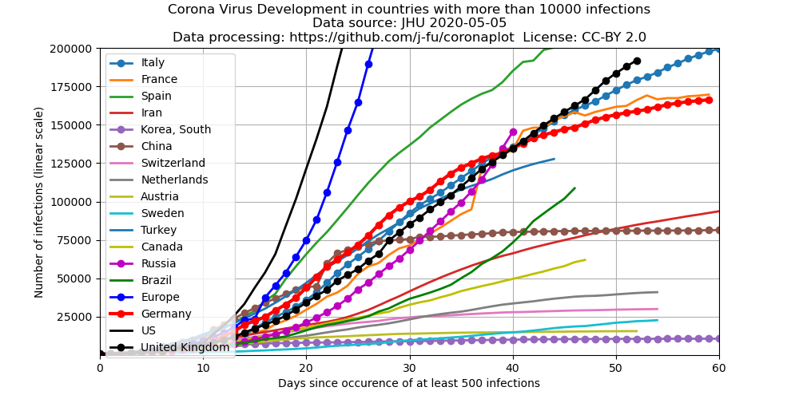

- [Diese Seite auf Deutsch](index.md)
- [Introduction](#introduction)
- [Absolute numbers](#absolute-numbers)
- [Logarithmic scale](#logarithmic-scale)
- [Development of daily growth rates](#development-of-daily-growth-rates)
- [Changes in this document](#changes)
- [Source code for the creation of the plots](https://github.com/j-fu/coronaplot)
- Further Links
    - Interactive [Epidemic Calculator](http://gabgoh.github.io/COVID/index.html)
      based on a mathematical disease model by Gabriel Goh (thanks, Sabine!)
    - [Investigation of the outbreak development](https://www.staff.uni-oldenburg.de/bernd.blasius/project/corona/) by Bernd Blasius using the same data
    - [Interview with Christian Drosten](https://www.zeit.de/wissen/gesundheit/2020-03/christian-drosten-coronavirus-pandemic-germany-virologist-charite/komplettansicht) - Virologist  and one of the main advisers of the German government during this crisis

## Introduction
The Center for Systems Science and Engineering (CSSE)  of Johns Hopkins University
collects and publishes the data of the diesease development.

After an idea of [Mark Handley](https://twitter.com/MarkJHandley/status/1237119688578138112?s=20) we take the same
data source and plot the data in a different way for those countries which have more than 3000 cases.

- [Blog post describing the project at CSSE](https://systems.jhu.edu/research/public-health/ncov/).
- [The](https://gisanddata.maps.arcgis.com/apps/opsdashboard/index.html#/bda7594740fd40299423467b48e9ecf6) corona virus map.
- Data for the plots come from the [github repository containing the current data](https://github.com/CSSEGISandData/COVID-19)
  which are [updated once per day around 23:59 (UTC)](https://github.com/CSSEGISandData/COVID-19/tree/master/csse_covid_19_data#update-frequency)
  and may lag behind the data in the map.    
  Data  for the  US are  based on  the state  data, county  data are
  ignored.  Data  for  Europe  currently  include   the  EU,
  Switzerland, Norway, UK and Serbia only. All other European countries have
  (as of March 22) less than 100 infections each.
- These data depend on many factors, among these are:
   - the real number of infections
   - the availability of tests.
   The later  strongly varies between countries. <del> and it can plausibly be assumed that it is increasing due to increasing government efforts </del>.

## Absolute numbers
 

Development of confirmed  adjusted cases since the first day with more than 500 reported infections. This representation compares the initial 
[exponential phases](https://en.wikipedia.org/wiki/Exponential_growth) of the spread of the virus.

## Logarithmic scale
 

This is the same plot, just with a logarithmic scale of the y-axis.

## Development of daily growth rates
 

 

These plots show the evolution of the average daily growth rates. A constant growth rate corresponds to an exponential growth. A constant *growth rate* of 100% per day corresponds to a *growth factor* of 2 per day and a daily doubling of case numbers.
A constant *growth  rate* of 10% per day corresponds to a *growth factor* of 1.1 per day. The right Y-axis shows the 
[doubling times](https://en.wikipedia.org/wiki/Doubling_time) (time it takes to double the number of infected)
corresponding to the different growth rates. Averaging is based on the geometric average of the growth factors.

### Comment on these plots

As described above, the case numbers are biased by the availability of tests.  Increasing availability of tests due to government actions appears to be a possible cause of the initial growth of the rate for most countries. If all or a fixed percentage of cases would be detected, one should expect a constant growth rate. As a consequence, the  growth rate is overestimated by a unknown extent.
On the other hand, if this interpretation is true, *and the availability of tests does not decrease* this also would mean that when the growth rate of detected cases is going down, the real  growth rate decreases as well.

## Changes
We document here significant changes besides data updates. 
### 2020-03-22
- Added 7-day average plot
- Switched averaging in the growth rate graph from arithmetic [mean](https://en.wikipedia.org/wiki/Mean) to geometric mean of the growth factors.  
For varying daily growh factors over the averaging period, the geometric mean tells us what would have been the *constant* daily growth factor  with the same outcome. Therefore, this type of mean is more adequate for this process. In comparison, before, in particular the US data had been biased by outliers. For comparison, here is the old graph with the data of March 22:

