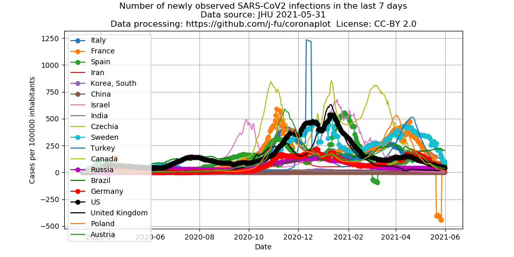
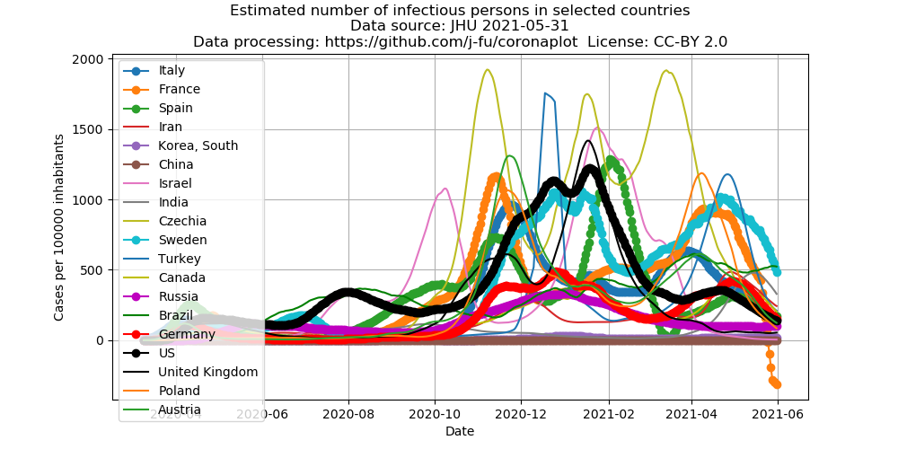
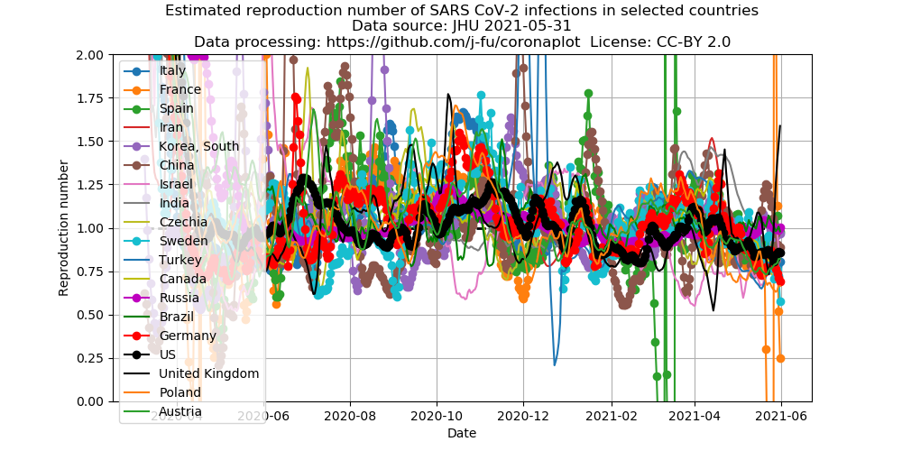

- [Diese Seite auf Deutsch](index.md) mit Plots für die deutschen Bundesländer
- [Source code](https://github.com/j-fu/coronaplot)
- Further links
   - the plots are inspired by the very similar [analysis by my colleague J. Polzehl](https://www.wias-berlin.de/people/polzehl/COVID-19.jsp),
     partially based on different data sources and including plots for the US states
   - a mathematical analysis by my colleagues [M. Kantner and Th. Koprucki](https://arxiv.org/abs/2004.09471)
     on possible strategies during the opening period
     

## Number of new infections during the previous 7 Tagen per 100000 inhabitants

<iframe id="igraph1"  src="world-new.html"  scrolling="no" style="border:none;" seamless="seamless" height="500" width="100%"></iframe>

## Estimate of the number of infectious persons

<iframe id="igraph2"  src="world-active.html"  scrolling="no" style="border:none;" seamless="seamless" height="500" width="100%"></iframe>

Here we try a conservative estimate of the number of  infectious persons.
We assume that an infected person is infectious on average 15 days.
In order to remove daily fluctuations, the calculations are bases on a 7 day moving 
average of the number of infected people.

## Estimate of the reproduction numbers
The German Robert Koch Institute (RKI) uses estimates the reproduction number based
on a method e.g. described [here](https://www.heise.de/newsticker/meldung/Corona-Pandemie-Die-Mathematik-hinter-den-Reproduktionszahlen-R-4712676.html).
Here, we use the same method, howver based on the 7 day moving 
average of the number of infected people instead of  RKI's "nowcast".

<iframe id="igraph2"  src="world-repro.html"  scrolling="no" style="border:none;" seamless="seamless" height="500" width="100%"></iframe>

##  Number of dead per 100000 inhabitants

<iframe id="igraph1"  src="world-dead.html"  scrolling="no" style="border:none;" seamless="seamless" height="500" width="100%"></iframe>

## Changes
### 2020-11-16
- New layout with more space for graphs
- Additonal interactive graphs via Plotly.jl
- Plots of numebers of corona deaths

We document here significant changes besides data updates. 

### 2020-05-06 
- We plot different data now. The last "old" plots are here:

 

 

### 2020-04-13
- Growth rate plot now uses doubling time as primary data, y-axes have been switched
### 2020-04-03
-  Additional [plots for  Germany](de-plots.md)
### 2020-03-29
- Additional data for Germany from the Robert Koch Institute (RKI). These are not published as time series.
These data  are watched by [Wikipedia](https://de.wikipedia.org/wiki/COVID-19-Pandemie_in_Deutschland#Infektionsfälle), and time series
are provided in the article. These data are used here.
### 2020-03-24
- For the international data used here, there is now one US entry in the new format time series files which appearantly
has been cleaned for the past. Counting seems to have changed. See also the [annoucement by JHU](https://github.com/CSSEGISandData/COVID-19/issues/1250).

### 2020-03-22
- Added 7-day average plot
- Switched averaging in the growth rate graph from arithmetic [mean](https://en.wikipedia.org/wiki/Mean) to geometric mean of the growth factors.  
For varying daily growh factors over the averaging period, the geometric mean tells us what would have been the *constant* daily growth factor  with the same outcome. Therefore, this type of mean is more adequate for this process. In comparison, before, in particular the US data had been biased by outliers. For comparison, here is the old graph with the data of March 22:

