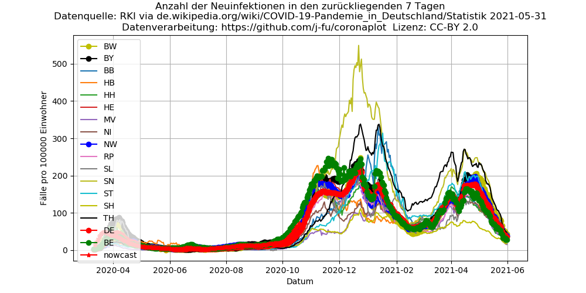
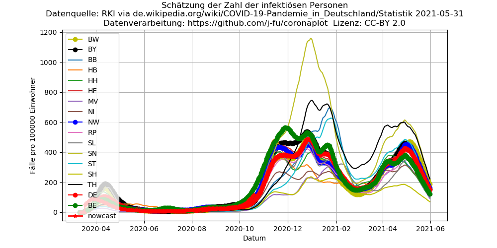

- [This page in English](index.en.md) with the plots for selected countries.
- [Quellcode](https://github.com/j-fu/coronaplot)
- Weitere Links
   - die Darstellungen sind inspiriert durch die sehr ähnliche [Analyse meines Kollegen J. Polzehl](https://www.wias-berlin.de/people/polzehl/COVID-19.jsp),   teilweise auf anderer Datengrundlage und mit Darstellung für die US-Bundesstaaten
   - eine mathematische Analyse meiner Kollegen [M. Kantner und Th. Koprucki](https://arxiv.org/abs/2004.09471)
     zur mögkichen Steuerung in der Lockerungsphase
     
## Einführung

Die weit verbreitete Darstellung der absoluten Zahlen der bestätigten Infektionen sagt viel über die Anfangsphase
der Pandemie aus, ist aber ungeignet, die Entwicklung in weiteren Infektionsphasen darzustellen. Dasselbe gilt für
die Darstellung der relativen Zunahme und der Verdopplungszeiten, welche gut  geeignet sind, den Effekt der Maßnahmen zum
Stopp der akuten exponentiellen Ausbreitung abzubilden. 

Der Verlauf der Öffnungsphase lässt sich mit anderen Kennzahlen besser verstehen.

## Anzahl der Neuinfektionen in den zurückliegenden 7 Tagen pro 100000 Einwohner.

Diese Darstellung richtet sich nach dem Kriterium für die am 6.5.2020 festgelegte
"Notbremse" für die Öffnung.

## Schätzung der Anzahl der aktiven Infektionen pro 100000 Einwohner

Hier wird versucht, eine konservative Schätzung der aktiv infizierten Personen vorzunehmen. 
Es wird angenommen, dass eine als infiziert gemeldete Patientin im Mittel 15 Tage lang infektiös ist.
Um tägliche Schwankugen herauszurechnen und längerfristige Trends zu sehen, wird zunächst 
eine gleitendes 7-Tage-Mittel der Infektionszahlen berechnet. 

## Abschätzung der Reproduktionszahl

Die vom Robert-Koch-Institut benutzte Methodik zur Abschätzung der Reproduktionszahl
ist z.B. [hier](https://www.heise.de/newsticker/meldung/Corona-Pandemie-Die-Mathematik-hinter-den-Reproduktionszahlen-R-4712676.html)
beschrieben. Hier wird dieselbe Methodik benutzt, allerdings wird die Berechnung nicht aufgrund der 
"Nowcast"- Daten vorgenommen, sondern aufgrund des 7-tägigen gleitenden Mittels der Infektionszahlen.

## Änderungen
Hier werden wesentliche Änderungen neben der Aktualisierung der Daten dokumentiert.

### 2020-05-06 
- Umstellung der Plots. Hier sind die letzten "alten" Plots zu sehen.

 

 

### 2020-04-13
- Auftragung der Wachstumsraten nach Verdopplungszeiten (Vertauschung der Y-Achsen)
### 2020-04-03
-  Zusätzliche [Darstellung für Deutschland](de-plots.md)
### 2020-03-29
- Zusätzliche Aufnahme der Daten des Robert-Koch-Instituts (RKI) für Deutschland. Leider werden dort Zeitreihen nicht publiziert. Allerdings werden diese Zahlen auf [Wikipedia](https://de.wikipedia.org/wiki/COVID-19-Pandemie_in_Deutschland#Infektionsfälle) beobachtet und in zeitlicher Abfolge dargestellt. Die hier verwendeten Daten sind von dort übernommen. 

### 2020-03-24
- Der hier benutzte internationale Datensatz hat jetzt ein neues Format, die Daten sind nicht mehr auf Staaten/Counties
aufgeschlüsselt. Des Weiteren wurden die zurückliegenden Daten bereinigt, und die Zählweise scheint sich etwas geändert
zu haben. Siehe auch die [Ankündigung der JHU](https://github.com/CSSEGISandData/COVID-19/issues/1250).

### 2020-03-22
- Zusätzliche Darstellung des wöchentlichen Mittels
- Für die Darstellung der Wachstumsraten wird jetzt anstelle des arithmetischen das geometrische [Mittel](https://de.wikipedia.org/wiki/Mittelwert) der Wachstumsfaktoren benutzt.   
    Für variierende tägliche Wachstumsfaktoren über einen gegebenen Zeitraum beschreibt das geometrische Mittel den *konstanten* Wachstumsfaktor, der das gleiche Ergebnis geliefert hätte. Damit ist es für den  hier untersuchten Prozess wesentlich adäquater. Insbesondere war die Ratenmittelung für die Vereingten Staaten stark durch Ausreißer beeinflusst. Zum Vergleich hier die alte Version mit den Daten vom 22.3.

