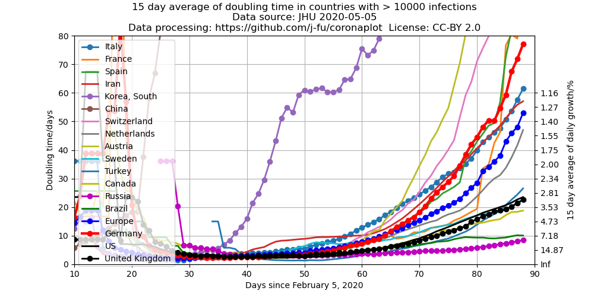
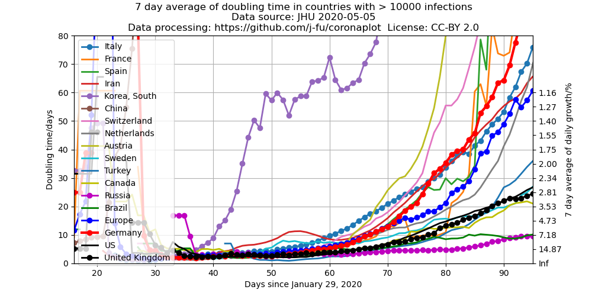

- [This page in English](index.en.md)
- [Darstellung für Deutschland](de-plots.md)
- [Einführung](#einführung)
- [Darstellung in absoluten Zahlen](#darstellung-in-absoluten-zahlen)
- [Logarithmische Skala](#logarithmische-Skala)
- [Entwicklung der täglichen Wachstumsraten](#entwicklung-der-täglichen-wachstumsraten)
- [Änderungen in diesem Dokument](#änderungen)
- [Quellcode für die Erzeugung der Plots](https://github.com/j-fu/coronaplot)
- Weitere Informationen
    - [  Mundschutz für jeden](https://www.facebook.com/groups/2725984604188343/): Facebook-Kampagne zum Tragen (und machen...) von Mundschutzmasken 
    - Interaktiver ["Epidemic Calculator"](http://gabgoh.github.io/COVID/index.html) auf der Basis eines mathematischen Ausbreitungsmodells von  Gabriel Goh (danke, Sabine!)
    - [Untersuchung des Ausbruchsgeschehens](https://www.staff.uni-oldenburg.de/bernd.blasius/project/corona/) durch Bernd Blasius unter Nutzung der selben Datenbasis
    - [Interview   mit Christian Drosten](https://www.zeit.de/wissen/gesundheit/2020-03/christian-drosten-coronavirus-pandemie-deutschland-virologe-charite/komplettansicht), Virologe un einer der wichtigsten Berater der Bundesregierung in dieser Krise
    - Ähnliche Projekte auf [covid19dashbords.com](https://covid19dashboards.com/):
       - [Vergleiche der länderspezifischen Entwicklungen](https://covid19dashboards.com/compare-country-trajectories/)
       - [Wachstumsanalyse](https://covid19dashboards.com/growth-analysis/)

## Einführung
Das  "Center for Systems Science and Engineering (CSSE)" der Johns Hopkins University sammelt und publiziert Daten der Entwicklung der Krankheit.

Nach einer Idee von [Mark Handley](https://twitter.com/MarkJHandley/status/1237119688578138112?s=20) nutzen wir hier diese Datenquelle, um den zeitlichen Verlauf im Vergleich verschiedener darzustellen.

- [Blogpost](https://systems.jhu.edu/research/public-health/ncov/), welcher as Projekt am CSSE beschreibt
- [Die](https://gisanddata.maps.arcgis.com/apps/opsdashboard/index.html#/bda7594740fd40299423467b48e9ecf6) bekannte Karte zur Verbreitung des Coronavirus.
- Die Daten für die Plots kommen aus dem [Github- Repository mit den aktuellen Daten](https://github.com/CSSEGISandData/COVID-19). Diese werden [einmal am Tag um 1:00 MEZ](https://github.com/CSSEGISandData/COVID-19/tree/master/csse_covid_19_data#update-frequency) aktualisiert (seltener als die der Karte)
Die Daten für Europa beinhalten die Daten für die EU-Länder, sowie für die Schweiz, Norwegen, Großbritannien und Serbien. Alle anderen europäischen Staaten haben zum aktuellen Zeitpunkt (4.4.) jeweils weniger als 500 Fälle.
- Die Daten hängen von mehreren Faktoren ab, unter anderem:
   - von der realen Zahl der Infektionen
   - von der Verfügbarkeit von Tests.
   Letztere variiert stark zeitlich und  zwischen den einzelnen Ländern.

## Darstellung in absoluten Zahlen
 
Entwicklung der bestätigten Fälle seit dem ersten Tag mit mehr als 500 Infektionen. 
Diese zeitlich verschobene Darstellung vergleicht die [exponentiellen Phasen](https://de.wikipedia.org/wiki/Exponentielles_Wachstum)
in den einzelnen Ländern.

## Logarithmische Skala
 

Die gleiche Darstellung wie oben, nur mit einer logarithmischen Skala der y-Achse. In diesem Fall entspricht das exponentielle Wachstum einer geraden Linie.

## Entwicklung der täglichen Wachstumsraten
 

 

Diese Darstellungen zeigen die Entwicklung der mittleren täglichen Wachstumsraten der Infektionszahlen. Eine konstante Wachstumsrate entspricht einem exponentiellen Wachstum. Eine konstante *Wachstumsrate* von 100% pro Tag entspricht einem *Wachstumsfaktor* von 2 pro Tag  und einer täglichen Verdopplung der Fallzahlen. Eine konstante *Wachstumsrate* von 10% pro Tag entspricht einem Wachstumsfaktor von 1.1 pro Tag. Die den Wachstumsraten entsprechenden [Generationszeiten](https://de.wikipedia.org/wiki/Generationszeit)  (Zeit in der sich die Fallzahlen verdoppeln) sind auf der rechten Y-Achse aufgetragen. Die Mittelung basiert auf dem geometrischen Mittel der Wachstumsfaktoren.

### Kommentar zu dieser Darstellung

Wie in der Einführung beschrieben, sind die hier genutzten Fallzahlen von der Verfügbarkeit von Tests beeinflusst. Eine wachsende Verfügbarkeit von Tests  erscheint als eine mögliche Ursache der anfänglichen Erhöhung der Wachstumsrate, die für die meisten Staaten zu sehen ist. Wenn alle oder ein fester Prozentsatz der Erkrankungen festgestellt würde, müsste die Wachstumsrate im Wesentlichen konstant sein. In der Konsequenz sind die Wachstumsraten für die Anfangsphasen vermutlich in unbekanntem Maße überschätzt. Falls diese Interpretation stimmt *und die Verfügbarkeit von Tests nicht sinkt* hieße das aber auch, dass eine fallende Wachstumsrate in dieser Darstellung eine Verringerung der realen Wachstumsrate anzeigt.

## Änderungen
Hier werden wesentliche Änderungen neben der Aktualisierung der Daten dokumentiert.
### 2020-04-03
-  Zusätzliche [Darstellung für Deutschland](de-plots.md)
### 2020-03-29
- Zusätzliche Aufnahme der Daten des Robert-Koch-Instituts (RKI) für Deutschland. Leider werden dort Zeitreihen nicht publiziert. Allerdings werden diese Zahlen auf [Wikipedia](https://de.wikipedia.org/wiki/COVID-19-Pandemie_in_Deutschland#Infektionsfälle) beobachtet und in zeitlicher Abfolge dargestellt. Die hier verwendeten Daten sind von dort übernommen. 

### 2020-03-24
- Der hier benutzte internationale Datensatz hat jetzt ein neues Format, die Daten sind nicht mehr auf Staaten/Counties
aufgeschlüsselt. Des Weiteren wurden die zurückliegenden Daten bereinigt, und die Zählweise scheint sich etwas geändert
zu haben. Siehe auch die [Ankündigung der JHU](https://github.com/CSSEGISandData/COVID-19/issues/1250).

### 2020-03-22
- Zusätzliche Darstellung des wöchentlichen Mittels
- Für die Darstellung der Wachstumsraten wird jetzt anstelle des arithmetischen das geometrische [Mittel](https://de.wikipedia.org/wiki/Mittelwert) der Wachstumsfaktoren benutzt.   
    Für variierende tägliche Wachstumsfaktoren über einen gegebenen Zeitraum beschreibt das geometrische Mittel den *konstanten* Wachstumsfaktor, der das gleiche Ergebnis geliefert hätte. Damit ist es für den  hier untersuchten Prozess wesentlich adäquater. Insbesondere war die Ratenmittelung für die Vereingten Staaten stark durch Ausreißer beeinflusst. Zum Vergleich hier die alte Version mit den Daten vom 22.3.

