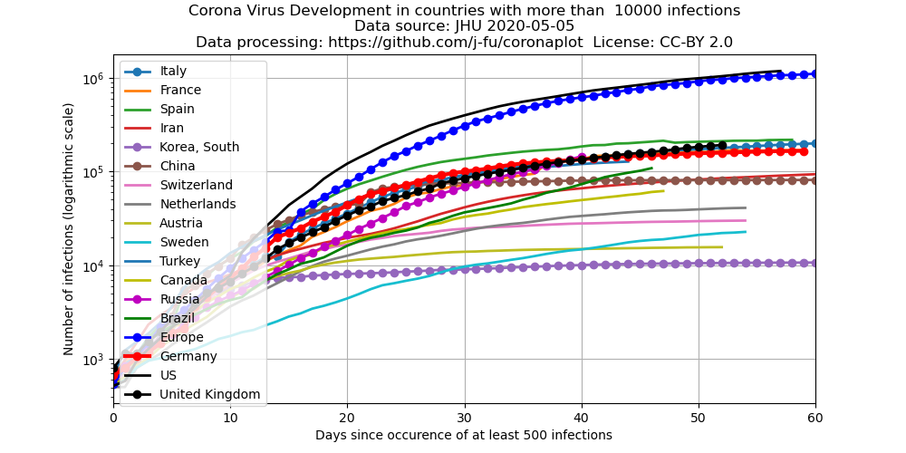

[Diese Seite auf Englisch](index.en.md)

Das  "Center for Systems Science and Engineering (CSSE)" der Johns Hopkins University sammelt und publiziert Daten der Entwicklung der Krankheit.

Nach einer Idee von [Mark Handley](https://twitter.com/MarkJHandley/status/1237119688578138112?s=20) nutzen wir hier diese Datenquelle, um den zeitlichen Verlauf im Vergleich der Länder mit mehr als 3000 Infektionen darzustellen.

- [Blogpost](https://systems.jhu.edu/research/public-health/ncov/), welcher as Projekt am CSSE beschreibt
- [Die](https://gisanddata.maps.arcgis.com/apps/opsdashboard/index.html#/bda7594740fd40299423467b48e9ecf6) bekannte Karte zur Verbreitung des Coronavirus.
- Die Daten für die Plots kommen aus dem [Github- Repository mit den aktuellen Daten](https://github.com/CSSEGISandData/COVID-19). Diese werden [einmal am Tag um 0:00  (UTC)](https://github.com/CSSEGISandData/COVID-19/tree/master/csse_covid_19_data#update-frequency) aktualisiert (seltener als die der Karte)
Die Daten für die USA basieren auf den Angaben für die Bundesstaaten. Die Daten für Europa beinhalten die Daten für die EU-Länder, sowie für die Schweiz, Norwegen und Großbritannien. Alle anderen europäischen Staaten haben zum aktuellen Zeitpunkt (17.3.) jeweils weniger als 100 Fälle.
- Die Daten hängen von mehreren Faktoren ab, unter anderem:
   - von der realen Zahl der Infektionen
   - von der Verfügbarkeit von Tests, welche zwischen den einzelnen Ländern stark variiert

## Darstellung in absoluten Zahlen
 
Entwicklung der bestätigten Fälle seit dem 22.1.2020. Dargestellt mit zeitlichen Verschiebungen, um die initialen [exponentiellen Phasen](https://de.wikipedia.org/wiki/Exponentielles_Wachstum) der Ausbreitung zu vergleichen.
Die Daten für Italien werden ohne zeitliche Verschiebung dargestellt. Die Daten für Deutschland sind z.B. um 8 Tage in die Zukunft verschoben, um sie mit denen für Italien zu vergleichen. Man sieht daher, dass die Entwicklung in Deutschland nur 8 Tage (Stand 16.3.) hinter der Entwicklung in Italien liegt.

## Logarithmische Skale
 

Die gleiche Darstellung wie oben, nur mit einer logarithmischen Skala der y-Achse. In diesem Fall entspricht das exponentielle Wachstum einer geraden Linie.

## Entwicklung der täglichen Wachstumsraten
 

Diese Darstellung zeigt die Entwicklung über 15 Tage gemittelten täglichen Wachstumsraten der Infektionszahlen. Eine konstante Wachstumsrate entspricht einem exponentiellen Wachstum. Eine konstante Wachstumsrate von 100% entspricht einer täglichen Verdopplung der Fallzahlen.

[Quellcode für die Erzeugung der Plots](https://github.com/j-fu/coronaplot)
